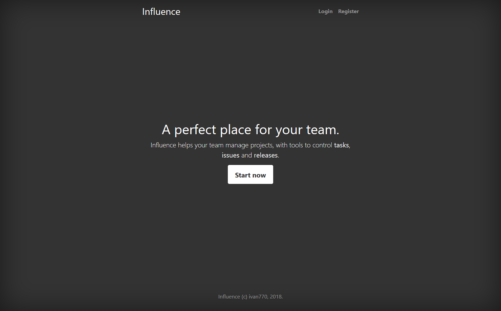
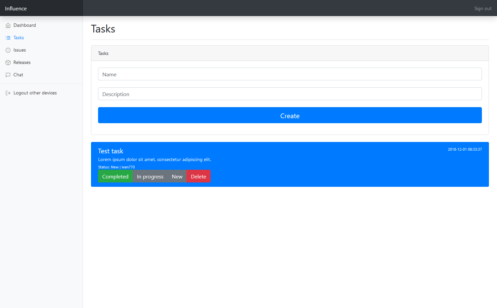
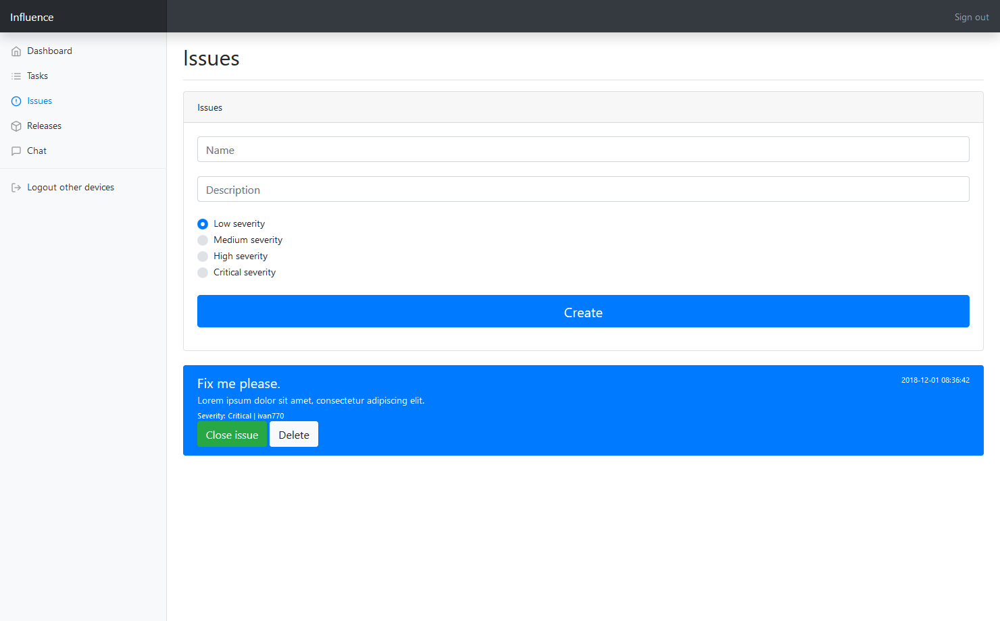
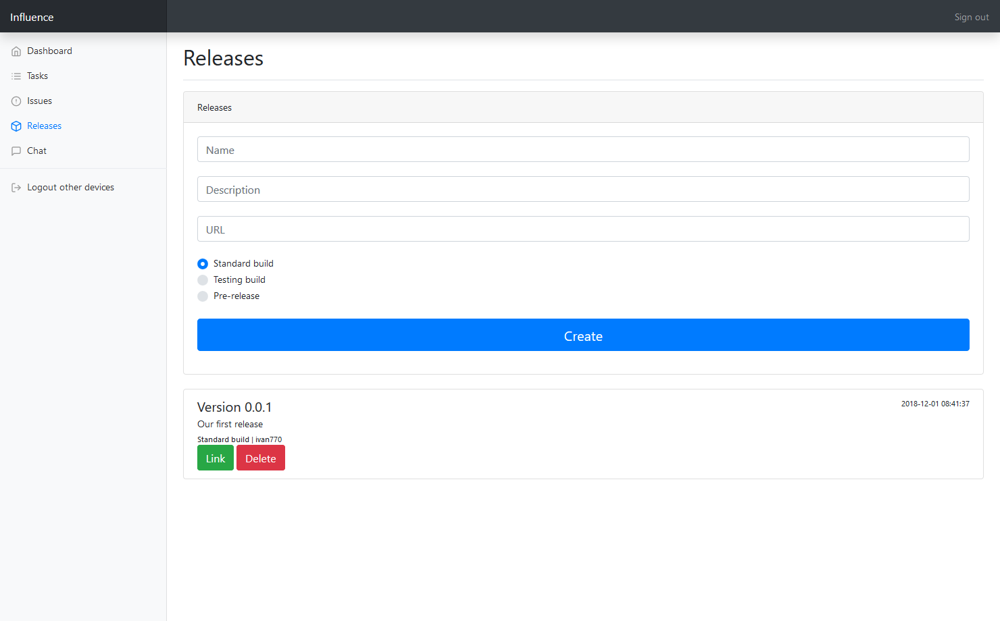
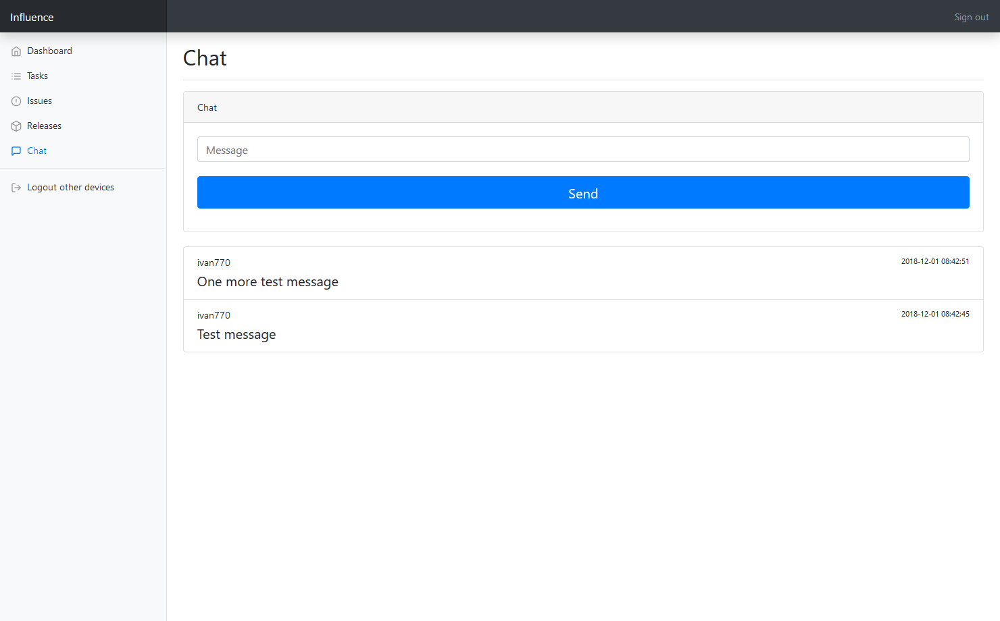

## About Influence

Influence is an open-source Laravel-based project manager, that is perfect for teams of any size.

## Task management

You can use "Tasks" feature to control different tasks that your project has.

Tasks have three statuses: **"New"**, **"In progress"**, **"Completed"**.

## Issue management

Of course, any project has some issues. And Influence provides you tools to manage them.

Issues have those levels: **"Low severity"**, **"Medium severity"**, **"High severity"**, **"Critical severity"**.

## Release management

You can easily manage releases from Influence dashboard, so your team can easily track everything.

## Chat

Of course, your team requires some basic chat. Influence provides it to you.

## API

Issues and releases have API, so your build bot can create issue on build fail, or create release when build completed successfully.

* POST your-domain.com/api/issues/new
* POST your-domain.com/api/releases/new

Parameters for issues:

* **id** - Project ID.
* **api** - API key. Can be found on dashboard.
* **name** - Issue name.
* **description** - Issue description.
* **level** - Severity level, from 0 to 3.

Parameters for releases:

* **id** - Project ID.
* **api** - API key. Can be found on dashboard.
* **url** - Release URL.
* **name** - Release name
* **description** - Release description
* **type** - Release type, from 0 to 2.

## Credits

[Logo](https://vk.com/denisk666)
